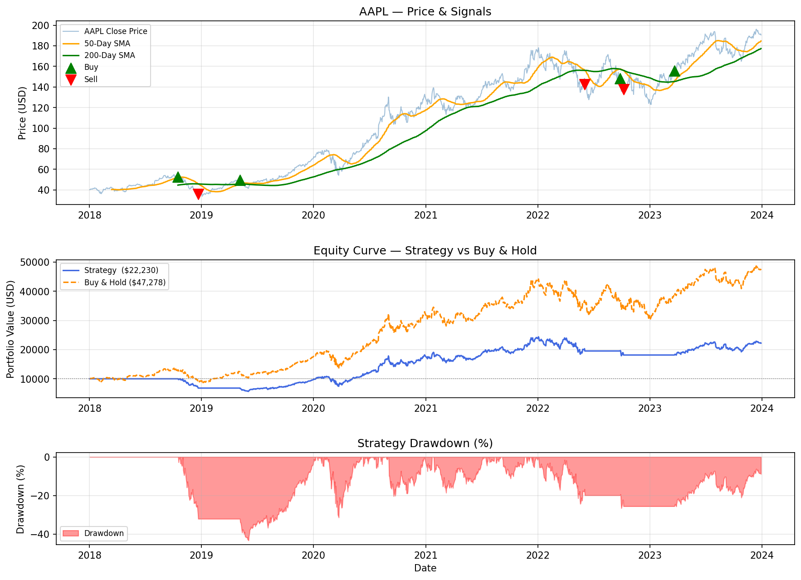

# Algorithmic Trading Backtester

A Python-based backtesting engine implementing a Golden Cross / Death Cross 
moving average crossover strategy on historical stock data.

## Strategy
- **Buy signal** — 50-day SMA crosses above 200-day SMA (Golden Cross)
- **Sell signal** — 50-day SMA crosses below 200-day SMA (Death Cross)

## Results (AAPL 2018–2024)
| Metric | Value |
|---|---|
| Starting Capital | $10,000 |
| Final Value | $22,230 |
| Strategy Return | 122.30% |
| Buy & Hold Return | 372.78% |
| Sharpe Ratio | 0.63 |
| Max Drawdown | -43.33% |

## Visualisation

## Tech Stack
- Python, pandas, numpy, matplotlib, yfinance

## Key Concepts
- Moving average crossover strategy
- Portfolio simulation and trade execution
- Risk metrics: Sharpe ratio, maximum drawdown
- Benchmark comparison against buy & hold
